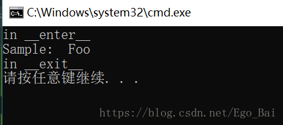

## 装饰器
 1. 使用装饰器可以在一个函数/方法前后添加方法，对方法进行修改
 2. @wraps接受一个函数来进行装饰，并加入了复制函数名称、注释文档、参数列表等等的功能。这可以让我们在装饰器里面访问在装饰之前的函数的属性
 3. 装饰器返回一个函数

重写父类方法可以解决很多数据需要中途需要进行修改的问题

## Meta类
1. 元类返回一个类

## 迭代器
iter() 

## 生成器
1.生成器表达式
2.生成器函数 yield 

> 整个过程看起来就是不断地 执行->中断->执行->中断 的过程。一开始，调用生成器函数的时候，函数不会立即执行，而是返回一个生成器对象；然后，当我们使用 next() 作用于它的时候，它开始执行，遇到 yield 语句的时候，执行被中断，并返回当前的迭代值，要注意的是，此刻会记住中断的位置和所有的变量值，也就是执行时的上下文环境被保留起来；当再次使用 next() 的时候，从原来中断的地方继续执行，直至遇到 yield ，如果没有 yield ，则抛出异常。简而言之，就是 next 使函数执行， yield 使函数暂停。


> “->”为函数标注，通常用于类型提示，是python3中引入的用法。
> 形参后面加冒号： 用于指定该形参的数据类型
> 函数定义后面加 -> ：用于指定函数的返回值的数据类型

**内置函数**
delattr()	getattr()	hasattr()	setattr()

enumerate() 函数用于将一个可遍历的数据对象(如列表、元组或字符串)组合为一个索引序列，同时列出数据和数据下标，一般用在 for 循环当中。

with的用法
有一些任务，可能事先需要设置，事后做清理工作。对于这种场景，Python的with语句提供了一种非常方便的处理方式。
基本思想是:with所求值的对象必须有一个enter()方法，一个exit()方法。

紧跟with**后面的语句被求值后，返回对象的**__enter__()方法被调用，这个方法的返回值将被赋值给as后面的变量。当with后面的代码块全部被执行完之后，将调用前面返回对象的exit()方法。

``` python
class Sample:
    def __enter__(self):
        print("in __enter__")

        return "Foo"

    def __exit__(self, exc_type, exc_val, exc_tb):
                    #exc_type：　错误的类型 
                    #exc_val：　错误类型对应的值 
                    #exc_tb：　代码中错误发生的位置 
        print("in __exit__")

def get_sample():
    return Sample()
with get_sample() as sample:
    print("Sample: " ,sample)
```

运行过程
    1. __enter__()方法先被执行
    2. __enter__()方法返回的值 - 这个例子中是"Foo"，赋值给变量'sample'
    3. 执行with中的代码块，打印变量"sample",其值当前为 "Foo"
    4. 最后__exit__()方法被调用


