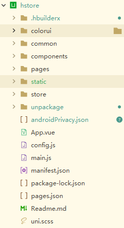

# 前端框架说明
## 介绍
公司所使用的前端技术框架为uni-app，个人理解为uni-app是集成了vue与微信小程序的一些优势，包含一些uni-app特有的api，以及条件编译；所以会Vue就能很快上手uni-app；建议再了解一下SCSS[（预处理CSS）](https://blog.csdn.net/weixin_67745264/article/details/125141904)。
开发工具建议使用[HbuilderX](https://www.dcloud.io/)，并配置好所需开发者工具的路径

## 环境部署
使用uni-app需要你电脑上安装过Vue框架，以及根据项目需要安装对应的开发者工具（如需求开发微信小程序则安装微信开发者工具），这里给出部分开发者工具与工具的官网链接。
[微信开发者工具](https://developers.weixin.qq.com/miniprogram/dev/devtools/download.html)，[支付宝开发者工具](https://render.alipay.com/p/f/fd-jwq8nu2a/pages/home/index.html)，安装vue通常使用[nodejs](http://nodejs.cn/download/)来进行安装，具体安装教程可以参考[nodejs安装教程](https://blog.csdn.net/momohhhhh/article/details/126319350)，如链接失效可自行百度。
## 编码规范
编码前建议先了解已有项目编码风格、以便于不同人员之间的协同开发
变量、属性命名：
> 一般采用小驼峰命名法，复数末尾加S（根据英语复数语法），或者加list，：如name、users、commentList。
> 不得使用Vue、js或者uni-app的内置关键字或者内置变量来命名，如if、which等

class命名：

> 一般采用短横线连接命名法，命名与业务功能相关或者与样式相关，如menu-content、flex-between等
> template最外层类名一般命名为content或者wrapper，如图所示
 
 文件命名：
> 一般根据具体业务需求来进行命名，单个单词小写，多个单词之间采用短横线连接如：choose-location.vue、login、setting等

方法命名与风格：

> 单个单词小写，多个单词采用小驼峰命名法。
> 一般将需要有输入（需要传参）的方法或者是需要改变已有数据的方法放在methods中；而将仅仅进行计算的方法放入computed中，此时要注意这个方法已经成为一个属性了，要按照使用属性的方式去使用。如图所示：
> 

## 项目结构

#### **colorui**
引入的一个外部CSS库，目前官网`https://www.color-ui.com/` 已经打不开了，其中的main.css可以根据项目需要来对标签进行一些全局修改，如去掉一些默认样式。
#### **common**

放置一些项目通用的js、css、scss文件，其中base64.js用来对文件进行base64转码，ble.js用来对蓝牙设备进行操作。
**common.js** 是需要重点注意的文件，主要是一些uni-app的相关封装方法，一些常用方法需要注意:如$query()、$back()、$toast()、$goto()、$doing()等，具体的介绍与使用参照`前端封装方法使用`章节。
**datamonitor.js**主要用来监测用户操作数的文件，如无需求，不必过多关注。
**geo.js**提供了百度坐标（BD09）、国测局坐标（火星坐标，GCJ02）、和WGS84坐标系之间的转换。后端保存的经纬度可能需要经过转换才能在地图组件中使用。
**hardware.js**中封装了一些跟硬件操作相关的方法。
**index.js**是所有common文件夹中js的入口文件，通过index.js挂载到vue实例中。
**irIcon.css**用来放置项目中使用到的ICON图标的class，需与[阿里巴巴矢量图标库](https://www.iconfont.cn/)配合使用，具体使用参照`前端封装方法使用`章节
**lazy.js**封装了一些懒加载相关方法
**main.scss**存放着一些项目的可复用的样式，项目中重复使用的样式可抽取到该文件中。
**request.js**封装着一些向后端发起网络请求的方法，主要是$callapi、$Pager，具体使用参照`前端封装方法使用`章节
**site.js**封装着一些与站点相关的全局方法，如获取标题，获取url，获取用户信息，复制到剪贴板等方法。
**unimp.js**对uni小程序uni-mp相关功能封装
**utils.js**一些常用工具方法的封装，如格式化浮点数、格式化时间、检查银行卡号、检查手机号、检查身份证号、深拷贝等方法
**websocket.js**主要是建立websocket连接所需方法
**wxh5.js**与微信H5功能相关的方法
#### components
存放着封装好的项目组件与通用组件，一般小组件以单个文件组成（可能与uni-app的的easycom组件规范相悖，以公司规范为准），大组件才需用文件夹将组件包裹，项目组件一般以项目名与组件名通过短横线连接方式命名，通用组件则以ir与组件名通过短横线连接方式命名,如下图所示
#### pages
uni-app固定pages中存放页面文件，需要注意的是分包问题，不同的小程序平台对分包的要求不一样，如需分包，一般在home\index文件夹存放tabbar的页面，然后每个tabbar作为一个文件夹，分包相关查看[uniapp分包详尽版](https://zhuanlan.zhihu.com/p/426186756)，组织结构如下所示
#### static
用来存放静态文件，一般是tabbar的icon，以及一些必要图片。如非必要请不要将图片放置在项目中，否则影响到项目打包大小。项目所需的一些图片可上传到七牛云，再通过URL引入，icon请从阿里巴巴矢量图标库中通过irIcon.css文件来引入，具体的图片图标引入方法参照`前端封装方法使用`章节。

#### store
存储相关目录，通过Vuex实现，通用的是封装了存放用户相关信息与获取用户信息的方法。
#### 其他文件
**config.js**项目的配置文件，主要配置项目的API的后端接口地址
**pages.json**配置tabbar、启动项、页面路径等
**uni.scss**存放着一些全局项目颜色的变量

## 前端封装方法使用
前端封装过的方法通常使用`$`美元符号前缀如$toast()，以便于其他封装方法区分开来。想了解封装的方法是如何成为全局方法？，推荐查看[Vue中 Vue.prototype使用详解](https://www.jb51.net/article/216703.htm)这篇文章。建议再了解一下异步编程，推荐查看[vue中异步函数async和await的用法说明](https://www.jb51.net/article/243485.htm)。
### 通用类方法
通用类方法位于`项目/common/common.js`路径下，主要包含给予用户提示、路由（页面）、上传下载（图片、视频）、存储（storage）等。详见思维导图。
 仅对分级为很重要的方法进行使用说明
#### $toast/$errtoast()
``` js
$toast(text, duration = 1000)
$errtoast(text = "网络错误,请稍后再试")
```
用来展示无需用户操作的提示信息，接收两个参数，text为你需要展示的内容，duration为持续时间（可选参数）默认为1秒；errtoast()用来展示给用户的错误信息；使用示例:

``` javascript
async whenLogined(res) {
	// 登录完成后回调
	this.$done();
	if (res && res.data) {
	this.$store.commit("SET_USER", res.data.userinfo);
	await this.$toast("登录成功");
	await this.$whichStore()
	await this.$goto("/pages/home/index")
				}
			},
```
#### $msg

```js 
$msg(text)
```

用来展示需要用户确定的提示信息，用户确认后才会消失。示例

``` js
this.$msg(`程序员小哥已经收到你送的${r.data.total_me}桶油(今天${r.data.today_me}桶)，小伙伴合计送了${r.data.total}桶油(今天${r.data.today}桶)`)
```

#### $query

``` js
$query(text, title = "询问")
```
用来询问用户的操作，接收两个参数，text为询问的内容，title（可选参数）为询问框的标题；返回值为布尔型，用户点击确定为true；示例：

``` js
async removeImage(index) {
	if (await this.$query('确定要删除该图片吗？')) {
	this.innerImages.splice(index, 1)
	this.onChange()
	}
},
```
#### $doing()与$done()
doing用来展示加载中的样式，done用于隐藏加载中样式；注意：doing和done必须配套使用，否则会出现一直在加载的情况，导致页面卡住的假象；一般用于需要提示用户正在加载数据方法的前后。示例：

``` js
this.$doing() //执行加载数据的方法前，展示加载样式
let res = await this.$callapi('finishSelfPick',{oid:item.oid})
this.$done() //加载数据方法结束，隐藏加载样式
```

#### $goto

``` javascript
$goto(url, redirect)
```
用于向url进行跳转；接收两个参数，url表示跳转的地址，redirect(可选参数)布尔值表示是否以重定向的方式进行跳转。此函数会根据所传url前缀的不同进行不同的操作，具体的封装请自行查阅。示例：

``` js
async goPage(path) {
	if (this.logged) {
	this.$goto(path)
} else {
	let query = await this.$query('登录后查看详情')
	if (query) {
	this.$goto('/pages/other/login')
		}
	}
},
```
#### $back

``` js
$back(success = null)
```

用于关闭当前页并返回上一页，接收一个可选参数success，success是函数执行成功后的回调。示例：

``` js
onCancel() {
	this.$back()
},
```
### 请求类方法
请求类方法位于`/pages/common/request.js`文件中，主要是用来向后端发起网络的方法，有以下三个，$callapi、$Loader、$Pager，其中callapi使用方法实现，其余两个使用类实现。
#### $callapi

``` js
$callapi(api, data = null)
```
普通的请求方法。接收两个参数，api为后端接口的路径名称，data(可选参数)类型为对象，接收url携带的查询参数；示例：

``` js
this.$doing()
let res = await this.$callapi('user/doProductCollect', { //前缀Host已在config.js文件中全局定义了。
		model: 'store',
		objid: this.user.applets_store_id
})
this.$done()
```

### $Pager
用于数据需要分页展示的请求方法。常用的接收的参数有三个：apiname接收后端接口的路径名称，param（可选参数）类型为对象，接收url携带的查询参数，size（可选参数）类型为正整形，表示一页数据的条数，默认值为10。值得注意的是Pager的类型是一个类，在使用时要按照使用类的方式来使用。示例：

``` js
products: new this.$Pager({  //实例化类
					apiname: 'user/getCollectedList',
					param: () => ({
						tag: "storeproduct"
					}),
					size: 20
				}),
```

